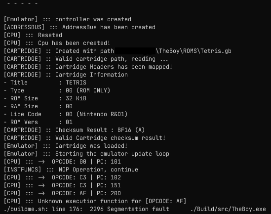
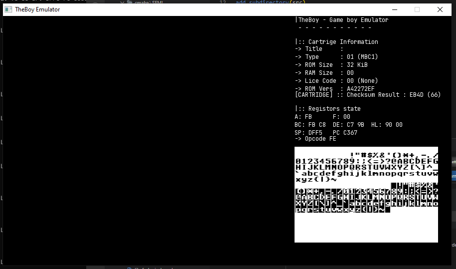
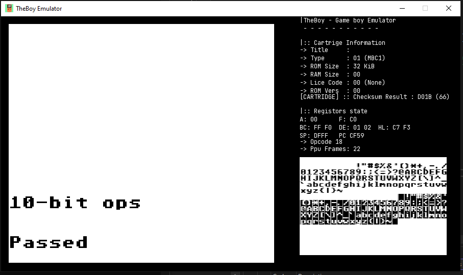
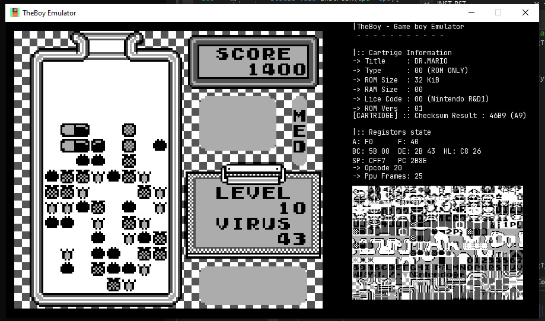

# TheBoy
GameBoy color emulator in c++  , created for a case study

---

### Usefull links
- [gddev](https://www.gbdev.io/) (Game Boy Development community)
- [Gameboy CPU (LR35902) instruction set](https://www.pastraiser.com/cpu/gameboy/gameboy_opcodes.html)
- [Game Boy: Complete Technical Reference by gekkio](https://gekkio.fi/files/gb-docs/gbctr.pdf)
- [Retrio - GameBoy test Roms](https://github.com/retrio/gb-test-roms)
---

# Dependencies
 ## Windows
 
 - Cmake installed;
 With Cmake, you can either build a Visual Studio Solution using the ```BuildMe.sh``` or open the Project Folder directly

---
 ### Build .sln
 - ***(Needed)*** Bash terminar for running .sh scripts
 - Run the Builme script with the ```-t=vs``` parameter.


 ### Visual Studio Cmake
 - Remove the `out` folder if present.
 - Open the __TheBoy__ folder on Visual Studio.
 - This can be build directly.
- Build Profiles should be created:
	- Open the project CmakeSettings, right clicking on the root CMakeList, and select ```CMake Settings for TheBoy```.
	- Add a `x64-Debug Verbose`, `x64-Debug` and `x64-Release Verbose` or more.
	- Add the command Argument `-DVERBOSE=false` to control the output text.


### Using Mingw
- Run the `buildme.sh -t=mingw` to compile the project.


## VScode (notes)
 
Under the Preference settings was needed to add, ```"cmake.generator": "MinGW Makefiles" ```, and on the c_cpp_properties (using the c++ extension pack), 
```JSON
            "intelliSenseMode": "windows-msvc-x64",
            "configurationProvider": "ms-vscode.cmake-tools"
```

---

# Build Script
Use this script to gather all the information needed, compile e execute;

### Available parameters

```./buildme.sh -h```
- *-r (--run)       | Will run the compilation result
- *-c (--clearall)  | Will clear the previous compilation and rebuild
- *-t (--target=)   | Changes the target generator
	- Current vailable generators: mingw

---

## Current Development state

- [x] Cartridge header map
	- [x] Cartridge memory layout 
- [x] Address Bus implementation
	- [x] Bus functions read/write
	- [x] Addres bus major memory values maped
	- [x] Read/Write 16bit version functions
- [x] Cpu Implementation
	- [x] OPCode translation
	- [x] Instruction implementation
	- [x] Stack implementation (Push/Pop 8&16bit)
- [x] Ram
	- [x] Working RAM allocation and operations
	- [x] High RAM allocation and operations
- [x] PPU
	- [x] VRam viewer implementation
	- [ ] Pixel Pipeline
	- [x] PixelFiFo
- [x] IO Interface
	- [x] Serial interface
- [ ] Main OutPut
	- [x] Initial preview


---

## Testing State
- CPU Instructions
	- [x] 01-special
	- [x] 02-interrupts
	- [x] 03-op sp,hl
	- [x] 04-op r,imm
	- [x] 05-op rp
	- [x] 06-ld r,r
	- [x] 07-jr,jp,call,ret,rst
	- [x] 08-misc instrs
	- [x] 09-op r,r
	- [x] 10-bit ops
	- [x] 11-op a,(hl)
	- [x] cpu_instrs
	- [ ] daa
	- [ ] dmg-acid2
	- [ ] instr_timing
	- [ ] mem_timing

---
### ScreenShots
``` Cartridge header out ```


``` OpCode Execution (JP) ```


``` VRam Viewer```


``` LCD View```

