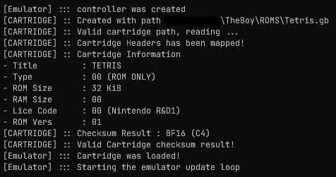

# TheBoy
GameBoy color emulator in c++  , created for a case study

### Usefull links
- gddev [web-site](https://www.gbdev.io/)
---

# Dependencies
> ## Win
> - Bash terminar for running .sh scripts
> - Mingw (gcc compiler): [Mingw web-site](https://www.mingw-w64.org/)
>
> ## VScode
> - If using vsCode, change the c_cpp_properties for the c/c++:
> 	- Add the **`out/lib`** to the include path;
> 	- Set the Mingw `(gcc)` compiler path;
> 	- C/C++ configuration settings exemple
> ---
>	```json
>	{
>	    "configurations": [
>	        {
>	            "name": "Win32",
>	            "includePath": [
>	                "${workspaceFolder}/**",
>					"${workspaceFolder}/out/include/**"
>	            ],
>	            "defines": [
>	                "_DEBUG",
>	                "UNICODE",
>	                "_UNICODE"
>	            ],
>	            "windowsSdkVersion": "10.0.19041.0",
>	            //"compilerPath": ".../Microsoft Visual Studio/2022/Community/VC/Tools/MSVC/14.31.31103/bin/Hostx64/x64/cl.exe",
>	            "compilerPath": "...\\mingw64\\bin\\gcc.exe",
>	            "cStandard": "c17",
>	            "cppStandard": "c++17",
>	            //"intelliSenseMode": "windows-msvc-x64",
>				"intelliSenseMode": "gcc-x64",
>	            "configurationProvider": "ms-vscode.cmake-tools"
>	        }
>	    ],
>	    "version": 4
>	}
>	```


---

# Build Script
Use this script to gather all the information needed, compile e execute;

### Available parameters

```./buildme.sh -h```
- *-r (--run)       | Will run the compilation result
- *-c (--clearall)  | Will clear the previous compilation and rebuild
- *-t (--target=)   | Changes the target generator
	- Current vailable generators: mingw

---

## Current Development state

- [x] Cartridge header map
	- [x] Cartridge memory layout 


---
### ScreenShots
``` Cartridge header out ```
